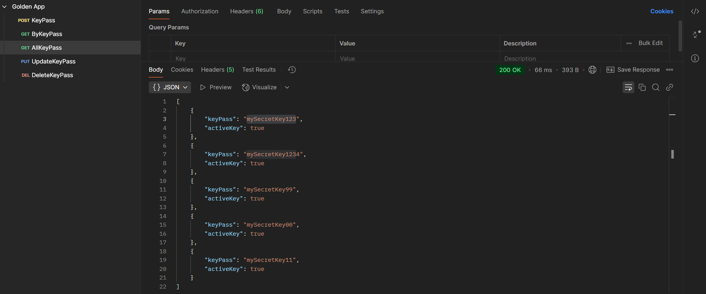

Read me

Spring and H2 database run.

.

Postman - CRUD
# springGoldenApplication DOC.

This repository is part of my learning path in the Java bootcamp. It features a Spring Boot application that demonstrates key components of the Spring ecosystem, with a focus on building RESTful APIs and architecture using MVC.

---


## About Spring & Spring Boot

**Spring** is a powerful framework for Java development, offering features like dependency injection, aspect-oriented programming, and data access.

**Spring Boot** builds on top of Spring to reduce boilerplate and simplify configuration. It enables:

- Automatic configuration of components
- Embedded web servers (Tomcat, Jetty)
- Production-ready applications with minimal setup

---

## Overview

| Technologies Used  ↓    |                          | Topics Covered  ↓                           |
|-------------------------|--------------------------|--------------------------------------------|
| Java 23                 |                          | REST API development with Spring Boot      |
| Spring Framework        |                          | Layered architecture using MVC             |
| Spring Boot             |                          | Dependency management via `pom.xml`        |
| Spring Data JPA         |                          | Application build and execution with `mvn  |
| Maven (mvn)             |                          | JPA entity modeling                        |
| H2 Database (in-memory) |                          | Custom exception handling                  |
| IntelliJ IDE            |                          | DTO usage for data abstraction             |
|                         |                          | Centralized configuration (`configuration`) |

---

## Project Structure

| Package / File            | Responsibility                                                                           |
|---------------------------|------------------------------------------------------------------------------------------|
| `configuration`           | Centralized configuration setup for the application                                      |
| `controller`              | Defines REST endpoints and maps HTTP requests to service methods                         |
| `dto`                     | Data Transfer Objects to carry data between layers. It's not the same entities of Model. |
| `exception`               | Custom exception classes and global error handling                                       |
| `model`                   | Domain entities mapped to database tables using JPA                                      |
| `repository`              | Interfaces for data persistence using Spring Data JPA                                    |
| `service`                 | Contains business logic and handles operations called by controllers                     |
| `application.java`        | Entry point of the application annotated with `@SpringBootApplication`                   |

---

## MVC Architecture

| Layer       | Responsibility                                                           | Project Example             |
|-------------|---------------------------------------------------------------------------|-----------------------------|
| Model       | Represents application data using JPA entities                           | `User.java`                 |
| View        | Not applicable (the project is a REST API)                               | -                           |
| Controller  | Handles HTTP requests and delegates to the service layer                 | `UserController.java`       |
| Service     | Implements business logic and application workflows                      | `UserService.java`          |
| Repository  | Performs database operations via Spring Data JPA                         | `UserRepository.java`       |

```
```JSON
keyPassRequestDTO = {
    keyPass: "1234-ABCD",
    activeKey: true
}

| Step | Variable / Action        | Value                                                        |
|------|--------------------------|---------------------------------------------------------------|
| 1    | Create KeyPass instance  | keyPass = new KeyPass()                                      |
| 2    | Set keyPass field        | keyPass.setKeyPass("1234-ABCD")                              |
| 3    | Set activeKey field      | keyPass.setActiveKey(true)                                   |
| 4    | Save to repository       | saved = keyRepository.save(keyPass)                          |
| 5    | Create response DTO      | KeyPassResponseDTO(keyPass="1234-ABCD", activeKey=true)      |
| 6    | Return DTO               | Returned to the Controller layer                             |
```


---

## Common Annotations

| Annotation | Description                                                                  |
|-----------|-------------------------------------------------------------------------------|
| `@SpringBootApplication`| Marks the main class and enables Spring Boot auto-configuration              |
| `@RestController` | Declares a class as a REST controller                                        |
| `@RequestMapping` | Maps HTTP paths to classes or methods                                        |
| `@GetMapping` / `@PostMapping` | Maps specific HTTP methods to controller methods                     |
| `@Autowired` | Injects required dependencies                                                |
| `@Entity` | Declares a class as a JPA entity                                             |
| `@Id`     | Marks a field as the primary key of an entity                                |
| `@GeneratedValue` | Specifies the strategy for primary key generation                            |
| `@Repository` | Declares a persistence interface managed by Spring                           |
| `@Service` | Marks a service class that contains business logic                           |
| `@ExceptionHandler` | Handles exceptions in a controller context                                   |
| `@Configuration` | Indicates a class contains Spring bean definitions                           |
| `@RestControllerAdvice` | Useful for creating consistent error responses across the whole API.                          |

---

## About `pom.xml`

The `pom.xml` file is used by **Maven** to manage project dependencies, plugins, and build configuration.  
In this project, it includes essential Spring Boot starters such as:

- `spring-boot-starter-web` — for building web applications and RESTful APIs
- `spring-boot-starter-data-jpa` — for persistence and database interaction
- `spring-boot-devtools` — for development enhancements like auto-reload
- `h2` — for in-memory database support in development/testing environments

It also specifies the Java version (`23`) and handles project packaging and build lifecycle.

- **XML Declaration**:
  ```xml
  <properties>
      <java.version>23</java.version>
  </properties>
  
  <plugin>
    <configuration>
        <source>${java.version}</source>
        <target>${java.version}</target>
    </configuration>
  </plugin>


---

## About Maven (mvn)

**Maven** is a project management and build tool. It reads the `pom.xml` file to:

- Manage dependencies and plugins
- Compile, package, and run the project
- Standardize build processes across environments

Common commands:

- `mvn clean – Deletes previous build artifacts
- `mvn install – Compiles and packages the app locally
- `mvn spring-boot:run – Launches the Spring Boot application

---

## How to Run

- Clone the repository
- Navigate to the project directory
- Run with `./mvnw spring-boot:run`
- Access the API at `http://localhost:8080`

---

## Notes

- This is a study project developed during a Java bootcamp
- The project follows clean architecture principles
- Key packages include:
    - `configuration` — for application-wide settings and beans
    - `dto` — to transfer data between layers
    - `exception` — for centralized error handling
- The application may be expanded in future iterations

---

## Author

Developed by [Deise Kinsk](https://github.com/deisekinsk)
